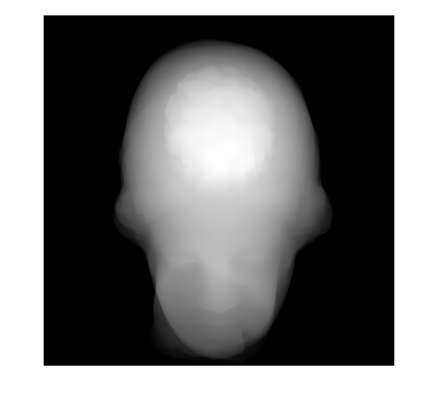
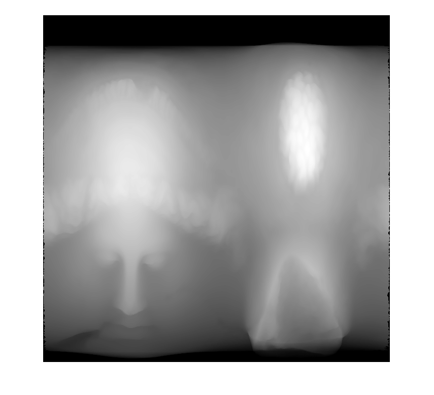

# Mesh Thickness 

This visual studio project calculates **normalized thickness of mesh** and return **depth map** for **matlab**. It builds **.mex file**  which can be used as function on matlab.  This project supports **2 different mode for depth map**.
## Depth map mode
|Normal depth|Z-axis depth map  | 
|--|--|
|The thickness of mesh like the X-ray |The thickness of rolled out mesh along the z-axis|
|||

## Input 
 1. (array)Full path to model(only .ctm format is supported)
(ex:`D:\\dev\\MESH-THK\\model\\venus.ctm','D:/dev/MESH-THK/model/bunny.ctm', and 'D:\dev\MESH-THK\model\venus.ctm'` are acceptable)
 2. (matrix)Euler rotation matrix 
(ex:` eye(3)`)
 3. (int)Thickness mode (0: nomal thickness, 1: z-axis depth map)

## Output

 1. 2048x2048 normalized depth map matrix
<!--stackedit_data:
eyJoaXN0b3J5IjpbMTE4NzgzMzc5OF19
-->